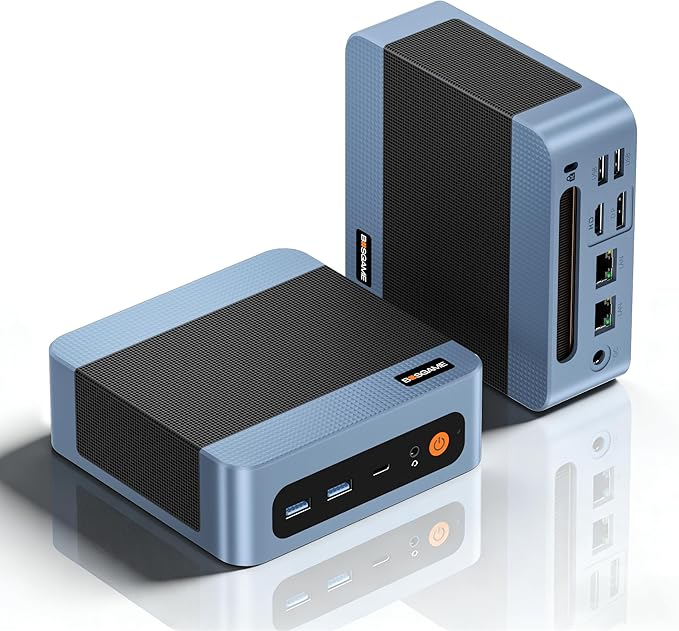
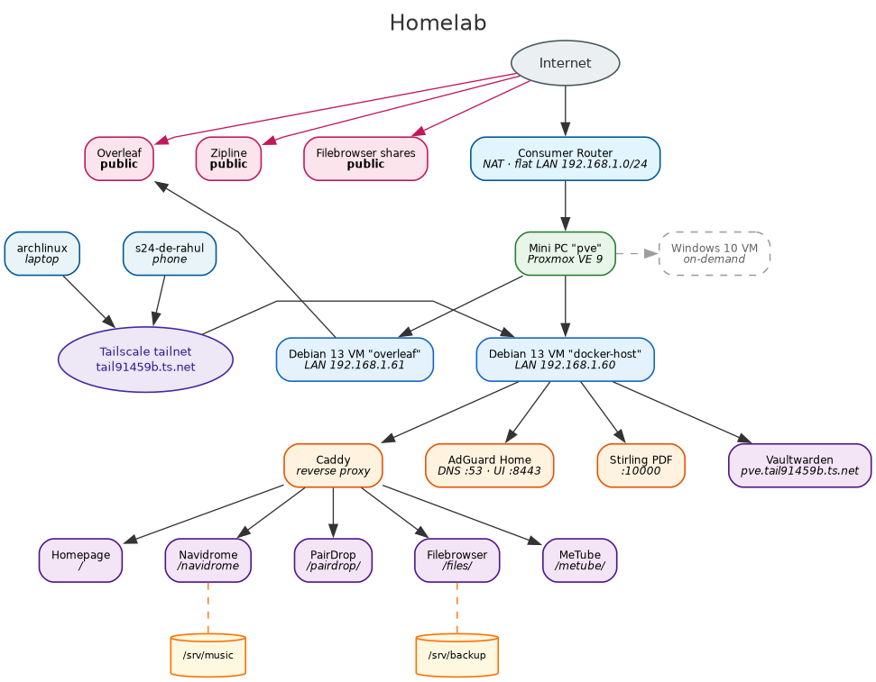

# Homelab

A personal homelab on a mini PC: Proxmox VE hosting Docker services —
passwords, music, file sharing, DNS ad-blocking, PDF tools and more.

## MiniPC Specs

BOSGAME E5 — AMD Ryzen 5300U · 16 GB RAM · 1 TB NVMe. Runs Proxmox VE 9.2,
hosting a Debian 13 VM (`docker-host`) that runs the Docker services.

  

## Services

| Service            | Description                         | URL                                             |
| ------------------ | ----------------------------------- | ----------------------------------------------- |
| Proxmox VE         | Hypervisor host                     | https://pve.tail91459b.ts.net:8006              |
| Homepage           | Dashboard                           | https://docker-host.tail91459b.ts.net/          |
| Vaultwarden        | Passwords                           | https://pve.tail91459b.ts.net                   |
| Navidrome          | Music streaming                     | https://docker-host.tail91459b.ts.net/navidrome |
| PairDrop           | Share files between devices         | https://docker-host.tail91459b.ts.net/pairdrop/ |
| Filebrowser        | Browse the laptop backups           | https://docker-host.tail91459b.ts.net/files/    |
| AdGuard Home       | DNS ad-blocking (tailnet)           | https://docker-host.tail91459b.ts.net:8443      |
| Stirling PDF       | PDF toolbox (merge, OCR, convert…)  | https://docker-host.tail91459b.ts.net:10000/    |
| MeTube             | Download videos (yt-dlp)            | https://docker-host.tail91459b.ts.net/metube/   |
| Overleaf           | Collaborative LaTeX editor (public) | https://overleaf.tail91459b.ts.net              |
| Zipline            | Share files by link (public)        | https://zipline.tail91459b.ts.net               |
| Filebrowser shares | Public read-only links              | https://fileshare.tail91459b.ts.net             |

## Schema

